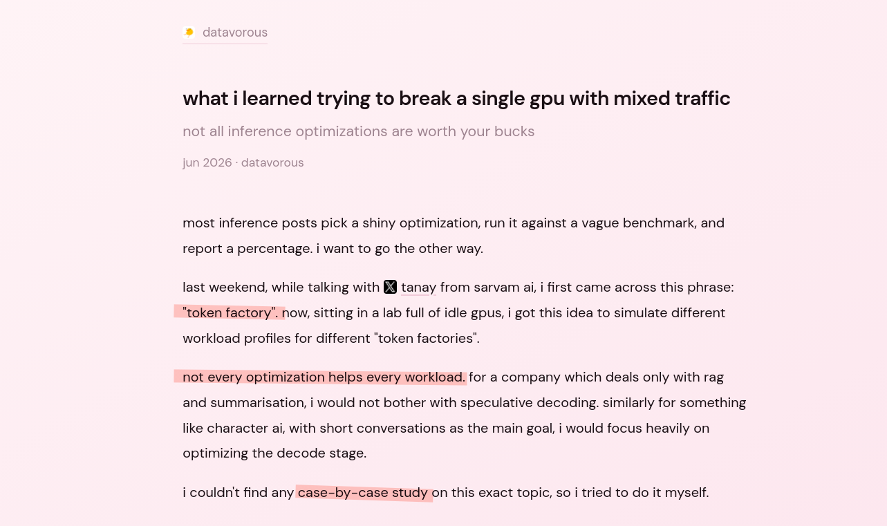

# to-fa

a study on inference serving

squeezing performance out of RTX 6000 Ada (48GB) running `Qwen2.5-14B-Instruct` under realistic mixed workloads.

accompanying post: [what i learned trying to break a single gpu with mixed traffic](https://datavorous.github.io/writing/lm-inference/)

[](https://datavorous.github.io/writing/lm-inference/)


## why?

got bored watching training loss curves, and had a few GPUs idling. an empty lab at night does give you a lot of ideas.

## plans

instead of going the {shiny optimization technique} -> {% of perf improvements}, i wish to go the opposite way. we will generate synthetic workloads (SILO, SISO, LISO, LILO) and use different types of workload distribution patterns (query, poisson etc). 

then, we try to figure out what an actual mid size AI company might have to deal in a monday morning with a single GPU (!! for now !!).

while watching [this](https://youtu.be/z2M8gKGYws4?si=0A6Pj4jjC-jhOjl0) video by PyTorch (Understanding the Inference Workload - Mark Moyou, NVIDIA), i got this idea.

different optimization techinques will benefit different types of workload, and only for a specific CAUSE can we INVESTIGATE, and finally OPTIMIZE, otherwise it's just a waste of time. a rag pipeline will benefit from a faster prefill stage, not from adding speculative decoding. 

**p.s. if you are looking for interns, [please hire me](https://datavorous.github.io), ill be your best hire till date if you pay me properly.**


## setup

```bash
sbatch serve.slurm
tail -f ~/<JOBID>.out
```

the log prints the exact tunnel command once ready.

open the tunnel (on your laptop)

```bash
ssh -NL 8000:<NODE>:8000 <user>@turing.iiit.ac.in
curl http://localhost:8000/health
```

## run benchmarks

```bash
uv run bench baseline # busy-monday baseline (32 rps poisson, 725 requests)
uv run bench # dev config (small, quick)
```

config is in `config.yaml`. results land in `results/<experiment>/<run_id>/`.

## analysis tools

run any of these after a bench run. all tools default to the latest run under `results/baseline/` if no path is given.

```bash
uv run summary-table [run_dir] # terminal: key metrics at a glance
uv run heatmap [run_dir] # png: token distribution heatmap
uv run latency-plot [run_dir] # png: TTFT and E2E latency per profile
uv run system-plot [run_dir] # png: KV cache, queue depth, prefix hit rate over time
uv run workload-timeline [run_dir] # png: profile mix (siso/silo/liso/lilo) over run
uv run token-counts [experiment] # terminal: prompt/budget token stats (pre-run)
```
## acknowldegements

> [!IMPORTANT] 
> The entire harness was built using Claude Sonnet 4.6  
> The code is not the MOAT, the experiments and inferences are.